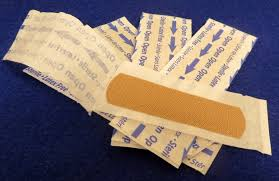

# Emergency-Kit
Hello Mr. Alexander
Here's my Family Emergency kit and whats inside of it.

 # Bandages
 almost every first aid kit must include bandages. band aids and the big stretchy bandages.
 

# Scissorrs 
In our first aid kit we keep a pair of scissors because you need them to cut off the bandages and other things.

# Thermometer
You need a Thermometer to check your temperature and to determine if you or someone in your family is sick.

# Ice 
We have Ice packs because, you should keep them for accidents like. if you run into someone else and your head has a bump on it or your leg has a rash you can use it to cool down the bruise.

